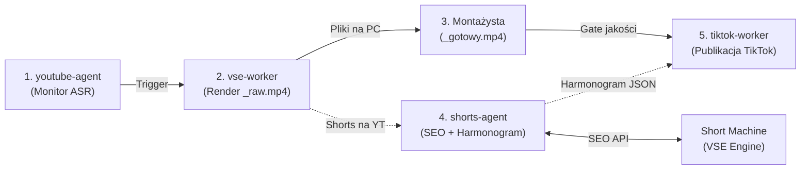

# Raport Analityczny: Architektura Shorts Pipeline i Specyfikacja Agenta `shorts-agent` dla Studio Prawy_PL

> **Autor**: `media-analyst` | **Data**: 2026-08-31 | **Workspace**: `media-dispatch`  
> **Temat**: Architektura Shorts Pipeline, Short Machine i specyfikacja `shorts-agent`  
> **Status**: Zakończone / Raport Kompletny

---

## 1. Cel i Zakres Prac

Celem zadania było zaprojektowanie, usystematyzowanie i udokumentowanie pełnego przepływu produkcyjno-dystrybucyjnego dla formatu krótkiego (Shorts / Reels / TikTok) dla kanału **Studio Prawy_PL** (`UCoH2G9By4OX3kcLsc8lHgDw`) oraz portalu **Prawy.pl**.

W ramach prac analitycznych opracowano:
1. **Kompletną specyfikację architektury pipeline'u** (4 agenty, rola Short Machine, flow katalogów na dysku PC, scheduling): [`docs/shorts-pipeline-architecture.md`](../../docs/shorts-pipeline-architecture.md).
2. **Dedykowaną specyfikację techniczną dla `shorts-agent`**: [`agents/shorts-agent/README.md`](../../agents/shorts-agent/README.md).
3. **Aktualizację mapy drogowej projektu**: [`ROADMAP.md`](../../ROADMAP.md) (dodanie Fazy 1b oraz Fazy 5b).

---

## 2. Podsumowanie Architektury 4-Agentowej



### 4 Agenty w Pipeline:
1. **`youtube-agent` (Ingestion & Gating)**:
   - Monitoruje kanał `UCoH2G9By4OX3kcLsc8lHgDw`.
   - Czeka na wygenerowanie napisów automatycznych (ASR) przez YouTube.
   - Po potwierdzeniu gotowości wywołuje pipeline w VSE.
2. **`vse-worker` (Core Generation & Video Rendering)**:
   - Generuje artykuł i metadane SEO na prawy.pl (Rank Math).
   - Wskazuje kandydatów na shorty (Claude 3.5 Sonnet).
   - Renderuje surowe wideo 9:16 do `C:\VSE\Shorts\[Film]_[date]\[klip]_raw.mp4`.
3. **`shorts-agent` (Optimization & Scheduling)**:
   - Skanuje opublikowane shorty na kanale Studio Prawy_PL.
   - Weryfikuje opisy — w przypadku braków odpytuje **Short Machine** i aktualizuje YouTube Data API.
   - Generuje harmonogram publikacji dla ~6 shortów z jednego filmu rozłożonych na kolejne dni w oknach szczytowych (`07:00`, `12:00`, `18:00`, `21:00`).
4. **`tiktok-worker` (Multi-Platform Distribution)**:
   - Publikuje zaakceptowane pliki `*_gotowy.mp4` na platformie TikTok z opisami i hashtagami z Short Machine.

---

## 3. Kluczowe Ustalenia Techniczne

### 3.1. Struktura Katalogów i Quality Gate na PC
```text
C:\VSE\Shorts\
  └── [Nazwa_Filmu]_[YYYY-MM-DD]\
        ├── metadata.json           # Transkrypty i punkty podziału z VSE
        ├── [klip_1]_raw.mp4       # Surowy render z VSE
        └── [klip_1]_gotowy.mp4    # Zaakceptowany plik z montażu (QUALITY GATE)
```
- **Zasada bezwzględna**: Automatyczna publikacja na platformy zewnętrzne (np. TikTok) dotyczy wyłącznie plików posiadających sufiks `_gotowy.mp4`.

### 3.2. Rola i Kontrakt Short Machine
- **Rola**: Dedykowany moduł optymalizacji SEO dla krótkich form wideo.
- **Endpoint**: `POST /v1/shorts/seo-description`.
- **Output**: Skondensowany hook, opis zoptymalizowany pod algorytm rekomendacji, precyzyjne hashtagi (#Shorts, #PrawyPL) oraz przypięty komentarz z linkiem do pełnego nagrania i artykułu.

### 3.3. Algorytm Harmonogramowania
- 1 film główny $\rightarrow$ ~6 shortów.
- Rozłożenie na 2–6 dni (unikanie kanibalizacji zasięgów).
- Domyślne okna godzinowe: `07:00`, `12:00`, `18:00`, `21:00` CEST.
- Format wyjściowy: `shared/schedules/shorts_schedule.json`.

---

## 4. Trzy Kluczowe Otwarte Pytania do Decyzji Użytkownika

1. **Metoda publikacji na TikToku (`tiktok-worker`)**:
   - Czy preferowane jest wdrożenie bezpośredniego uploadu przez oficjalne **TikTok Content Posting API** (wymaga weryfikacji aplikacji deweloperskiej TikTok), czy mechanizm półautomatyczny (przygotowanie paczki wideo + opis i notyfikacja na Telegramie)?
2. **Kto wgrywa Shorty na YouTube**:
   - Czy pliki shortów są wgrywane na YouTube ręcznie przez zespół, a `shorts-agent` wyłącznie skanuje kanał i wzbogaca opisy o SEO, czy docelowo `shorts-agent` ma również realizować automatyczny upload plików wideo przez `videos.insert`?
3. **Architektura uruchomieniowa Short Machine**:
   - Czy Short Machine ma być zaimplementowany jako nowy endpoint bezpośrednio w kontenerze `vse-api` na VPS (`/v1/shorts/seo-description`), czy jako lokalny moduł w repozytorium `media-dispatch`?

---

## 5. Zaktualizowane Zasoby w Repozytorium

- **Architektura**: [`docs/shorts-pipeline-architecture.md`](../../docs/shorts-pipeline-architecture.md)
- **Specyfikacja agenta**: [`agents/shorts-agent/README.md`](../../agents/shorts-agent/README.md)
- **Roadmapa**: [`ROADMAP.md`](../../ROADMAP.md) (dodana Faza 1b oraz Faza 5b)

---

*[media-analyst | media-dispatch 31.08.2026] — raport kompletny*
