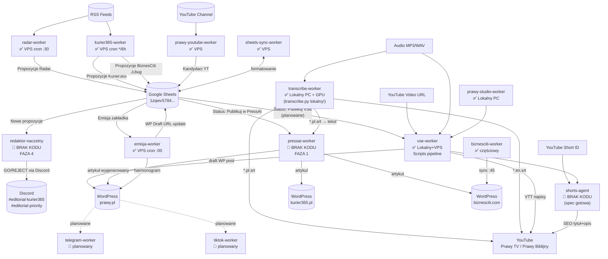

# Raport: Pełny Inwentarz Agentów — media-dispatch

**Callsign:** `media-analyst-03`  
**Data:** 2026-09-11 | 22:30 CEST  
**Status:** raport kompletny  

---

## A. Mapa Agentów

### Warstwa 0 — Infrastruktura / Baza

| Agent | Callsign | Status | Co robi | Środowisko |
|-------|----------|--------|---------|------------|
| **base** | `worker-base` | ✅ zaimplementowany | Klasa bazowa `WorkerBase` dla wszystkich workerów; źródła RSS i trend signals | Lokalny PC / VPS |

**Szczegóły:**
- `agents/base/worker_base.py` — 16 KB, klasa bazowa z `health_check()`, `process()`, `get_status()`
- `agents/base/sources/` — konfiguracje źródeł RSS
- `agents/base/trend_signals/` — sygnały trendów
- Input: n/d (biblioteka) | Output: interfejs dla workerów
- Zależności: brak (jest zależnością innych)

---

### Warstwa 1 — Intelligence (zbieranie informacji)

| Agent | Callsign | Status | Co robi | Środowisko |
|-------|----------|--------|---------|------------|
| **radar-worker** | `radar-worker` | ✅ zaimplementowany | Monitoruje RSS / Google Trends, wrzuca propozycje Prawy.pl do Sheets | VPS oracle |
| **kurier365-worker** | `kurier365-worker` | ✅ zaimplementowany | Zbiera tematy z RSS dla kurier365.pl i biznesciti.com, sync do Sheets | VPS oracle |
| **prawy-youtube-worker** | `prawy-youtube-worker` | ✅ zaimplementowany | Wykrywa nowe filmy na kanale Prawy TV, zasilaa zakładkę `Kandydaci YT` | VPS oracle |

**Szczegóły radar-worker:**
- Kod: `agents/radar-worker/radar_sheets_sync.py` (10 KB)
- Input: RSS feeds, Google Trends
- Output: Propozycje Radar (GID: 514074648) w Sheets `1zqwvS784EaZh1EJIcXk1DliAau1r4X15ENFJjloDSaM`
- Cron: co godzinę o `:30` na VPS
- Zależności: Google Sheets SA, `worker_base.py`
- ⚠️ Bug otwarty: CONTENT_RADAR_JWT brakuje w .env

**Szczegóły kurier365-worker:**
- Kod: `agents/kurier365-worker/worker.py` (38 KB!), `kurier365_sheets_sync.py` (6 KB)
- Input: RSS (agencje newsowe)
- Output: Propozycje Kurier365 (GID: 1073549292) + Propozycje BiznesCiti (GID: 1900951726)
- Cron zasilanie: co 6 godzin (`0 */6 * * *`); sync: co godzinę `:15`
- Zależności: Google Sheets SA, PressAI API
- ⚠️ Bug otwarty: routing BiznesCiti (pusta zakładka)

**Szczegóły prawy-youtube-worker:**
- Kod: `agents/prawy-youtube-worker/worker.py` (5 KB) + `shorts_pending/`
- Input: YouTube API (kanał Prawy TV — `UCNXh5eIlMVxnUBpTMKUp4CA`)
- Output: zakładka `Kandydaci YT` (GID: 1644472360)
- Zależności: YouTube Data API v3, OAuth VSE

---

### Warstwa 2 — Editorial (decyzje redakcyjne)

| Agent | Callsign | Status | Co robi | Środowisko |
|-------|----------|--------|---------|------------|
| **redaktor-naczelny** | `redaktor-naczelny` | 📝 opisany-tylko | Meta-agent syntetyzujący raporty workerów wywiadowczych i proponujący content plan per portal | brak |

**Szczegóły:**
- Katalog: `agents/redaktor-naczelny/README.md` — tylko README, **brak kodu**
- README jawnie mówi: "Status: Planowany FAZA 4"
- Konstytucja: `.agents/knowledge/editorial-worker-constitution.md` — definiuje zasady pracy
- Input: raporty feed-crawler, content-radar, historia publikacji
- Output: content plan per portal → dispatch do producentów
- 🚨 Brak implementacji — FAZA 4

**Kanały Discord (skonfigurowane, ale worker nie istnieje jako kod):**
- `#editorial-kurier365` → `DISCORD_WEBHOOK_KURIER365` — WSZYSCY kandydaci
- `#editorial-priority` → `DISCORD_WEBHOOK_PRIORITY` — tylko P0 i Gmail współpracownicy

---

### Warstwa 3 — Production (tworzenie treści)

| Agent | Callsign | Status | Co robi | Środowisko |
|-------|----------|--------|---------|------------|
| **vse-worker** | `vse-worker` | ✅ zaimplementowany | YT URL / MP3 → VSE API → SEO + draft WP | Lokalny PC + VPS oracle |
| **transcribe-worker** | `transcribe-worker` | ✅ zaimplementowany | Audio (mp3/wav/etc.) → SRT (PL + EN), faster-whisper + VAD + CUDA | Lokalny PC z GPU |
| **pressai-worker** | `pressai-worker` | 📝 opisany-tylko | Tekst/link/mail → artykuł WP przez PressAI | brak |
| **shorts-agent** | `shorts-agent` | 📝 opisany-tylko | YouTube Shorts → SEO opis + hashtagi + pinned comment przez Short Machine API | brak |
| **prawy-studio-worker** | `prawy-studio-worker` | ✅ zaimplementowany | Zarządza pipeline Studio Prawy — filmy z lokalu do VSE, Sheets, YouTube | Lokalny PC + VPS |

**Szczegóły vse-worker:**
- Katalog: `agents/vse-worker/` — README + `scripts/`
- Skrypty: `biblia_backlog_pipeline.py`, `biblia_full_pipeline.py`, `prawy_standard_pipeline.py`, `process_shorts_describe.py`
- Input: YouTube URL lub plik MP3
- Output: draft WP (prawy.pl), metadane YT, napisy VTT
- Środowisko: pipeline inicjowany lokalnie, wykonanie na VPS (SSH)
- Zależności: VSE API (`https://vse.impresjapr.pl/v1/`), JWT auth, YouTube OAuth
- Znane pułapki: 18 w konstytucji (`vse-worker-constitution.md`)

**Szczegóły transcribe-worker:**
- Kod: `agents/transcribe-worker/transcribe.py` (niewidoczny w repo? — README + constitution istnieje)
- Uruchamiany lokalnie (`py -3.12 transcribe.py`)
- Input: mp3/wav/m4a/mp4/wmv/wma/flac/ogg/aac/opus
- Output: `.pl.srt` + `.en.srt` (obok pliku źródłowego)
- Stack: faster-whisper 1.2.1, CUDA 12.4, RTX 4060
- ⚠️ Uwaga: skrypt `transcribe.py` nie jest widoczny w katalogu repo — tylko README + constitution. Możliwe że plik jest lokalny i nie wcommitowany.
- Zależności: brak zewnętrznych API (GPU lokalny)

**Szczegóły pressai-worker:**
- Katalog: `agents/pressai-worker/README.md` — tylko README stub, **brak kodu**
- README: "Status: Planowany FAZA 1"
- Paradoks: mimo że opisany jako FAZA 1 (pierwsza!), integracja PressAI istnieje już w kurier365-worker i radar-worker przez `_sheets_sync.py`
- Input: URL / mail / tekst
- Output: draft WP

**Szczegóły shorts-agent:**
- Katalog: `agents/shorts-agent/README.md` — 11 KB README (spec bardzo rozbudowana), **brak kodu worker.py**
- Spec gotowa od 31.08.2026 (wg current.md)
- Short Machine API już działa w VSE (`/v1/shorts/describe`) od 31.08.2026
- Input: YouTube Short URL / ID
- Output: tytuł SEO (≤45 zn), opis (150-350 zn), hashtagi (max 5), pinned_comment

**Szczegóły prawy-studio-worker:**
- Kod: `agents/prawy-studio-worker/worker.py` (23 KB), `config.example.json`, `films_template.json`
- Input: JSON z danymi filmów (z lokalnego Sheets)
- Output: pipeline VSE + YT upload metadata
- Zależności: VSE API, Sheets

---

### Warstwa 4 — Distribution (dystrybucja)

| Agent | Callsign | Status | Co robi | Środowisko |
|-------|----------|--------|---------|------------|
| **emisja-worker** | `emisja-worker` | ✅ zaimplementowany | Sync arkusza Emisja ↔ VSE ↔ WP (harmonogram publikacji Prawy TV) | VPS oracle |
| **biznesciti-worker** | `biznesciti-worker` | ✅ częściowy | Sync propozycji BiznesCiti → PressAI → WP | VPS oracle |
| **sheets-sync-worker** | `sheets-sync-worker` | ✅ zaimplementowany | Aktualizuje arkusz Editorial Schedule, formatuje zakładkę Kandydaci YT | VPS oracle |
| **youtube-worker** | *(brak katalogu)* | 🚧 planowany | Upload wideo na YouTube | brak |
| **wp-publisher** | *(brak katalogu)* | 🚧 planowany | Publikacja drafts WordPress | brak |
| **tiktok-worker** | *(brak katalogu)* | 🚧 planowany | Upload / opis TikTok | brak |
| **telegram-worker** | *(brak katalogu)* | 🚧 planowany | Dystrybucja na Telegram | brak |

**Szczegóły emisja-worker:**
- Kod: `agents/emisja-worker/emisja_sheets_sync.py` (9 KB)
- Cron: co godzinę o `:00`
- Input: arkusz Emisja (GID: 809929940) z YouTube ID + datą emisji
- Output: sync VSE → WP draft URL w arkuszu
- Zależności: Google Sheets SA, VSE API

**Szczegóły biznesciti-worker:**
- Kod: tylko `biznesciti_sheets_sync.py` (6 KB), brak main worker
- Bug: brakuje routingu dla kategorii biznesowych w kurier365-worker
- Cron: co godzinę `:45`

**Szczegóły sheets-sync-worker:**
- Kod: `update_editorial.py` (10 KB), `apply_kandydaci_formatting.py` (6 KB)
- Input: zewnętrzne dane
- Output: arkusz Editorial Schedule, formatowanie Kandydaci YT

---

## B. Luki — Czego brakuje do działającego pipeline

### 🔴 Krytyczne luki (blokują flow)

| # | Brakujący komponent | Wpływ | Blokuje |
|---|---------------------|-------|--------|
| 1 | **transcribe.py** nie wcommitowany do repo | Worker działa tylko lokalnie, niereplikowalny | Cały pipeline audio→SRT |
| 2 | **pressai-worker/worker.py** — brak kodu | Jedyny entry-point dla pipelinu text→WP z zewnętrznych źródeł | Kurier365, BiznesCiti autonomia |
| 3 | **shorts-agent/worker.py** — brak kodu | Short Machine API gotowe, spec gotowa, implementacji brak | Automatyzacja Shorts |
| 4 | **redaktor-naczelny/worker.py** — brak kodu | Brak centralnej orkiestracji redakcyjnej | Cały Human-In-The-Loop loop |
| 5 | **CONTENT_RADAR_JWT** brak w .env VPS | radar-worker nie może autentykować się do Content Radar API | Intelligence Warstwa 1 |
| 6 | **BiznesCiti routing bug** w kurier365-worker | Propozycje BiznesCiti puste | Portal biznesciti.com |

### 🟡 Średnie luki (ograniczają automatyzację)

| # | Brakujący komponent | Wpływ |
|---|---------------------|-------|
| 7 | **youtube-worker** (brak katalogu) | Upload YT w pełni ręczny |
| 8 | **wp-publisher** (brak katalogu) | Publikacja WP manualna (tylko draft tworzony przez VSE) |
| 9 | **telegram-worker** (brak katalogu) | Brak dystrybucji do Telegram |
| 10 | **tiktok-worker** (brak katalogu) | Brak dystrybucji do TikTok |
| 11 | **Dropdown Status Sheets** — brak walidacji | Propozycje Kurier365 + BiznesCiti bez enforced dropdownu |
| 12 | **biblia-worker** (wg current.md: commit lokalnych skryptów) | Skrypty biblijne niezsynchronizowane z repo |
| 13 | **Discord Interactions endpoint** — brak FastAPI implementacji | Redaktor Naczelny bez GUI w Discordzie |

### 🔵 Niskie priorytety

| # | Brakujący komponent | Wpływ |
|---|---------------------|-------|
| 14 | Detekcja `Publikuj VSE` w sync scripts | Brak auto-triggerowania VSE pipeline ze Sheets |
| 15 | TikTok — upload przez Premiere Pro (ręczny) | Planowe, nie blokuje |

---

## C. Diagram Przepływów

---

## D. Rekomendacja: Które 3 Agenty Zaimplementować Następne

### 🥇 #1 — shorts-agent/worker.py

**Uzasadnienie:**
- Short Machine API gotowe i przetestowane na VPS od 31.08.2026
- Spec (README) bardzo rozbudowana — 11 KB gotowej dokumentacji
- Skrypt `process_shorts_describe.py` już istnieje w `vse-worker/scripts/` — to wzorzec
- Shorts to najwyższy reach na YouTube z minimalnym wysiłkiem
- Blokada: brakuje tylko `worker.py` który wywoła istniejące API
- **Szacowany nakład: 1 sesja dev**

### 🥈 #2 — transcribe-worker/transcribe.py commit do repo

**Uzasadnienie:**
- Worker działa lokalnie (wg README i konstytucji) ale skrypt NIE jest w repo
- Brak commitu = brak replikowalności, brak historii, brak wersjonowania
- To jedyna brakująca część działającego audio pipeline
- Połączenie z pressai-worker (SRT → artykuł z wywiadu) to high-value flow
- **Szacowany nakład: 1 krótka sesja (push istniejącego pliku)**

### 🥉 #3 — Fix: BiznesCiti routing + pressai-worker integration

**Uzasadnienie:**
- kurier365-worker/worker.py (38 KB) już istnieje i obsługuje Kurier365
- Dodanie routingu BiznesCiti to prawdopodobnie kilkanaście linii kodu
- Zakładka Propozycje BiznesCiti + biznesciti_sheets_sync.py istnieje
- Portal biznesciti.com nie produkuje contentu mimo gotowej infrastruktury
- Przy okazji: wdrożenie pressai-worker jako thin wrapper wokół istniejących sync scripts
- **Szacowany nakład: 1 sesja dev**

---

## Podsumowanie Stanu Projektu

| Warstwa | Agentów | Zaimplementowanych | Opisanych-tylko | Planowanych |
|---------|---------|-------------------|-----------------|-------------|
| 0 — Baza | 1 | 1 | 0 | 0 |
| 1 — Intelligence | 3 | 3 | 0 | 0 |
| 2 — Editorial | 1 | 0 | 1 | 0 |
| 3 — Production | 5 | 3 | 2 | 0 |
| 4 — Distribution | 7 | 3 (+1 częściowy) | 0 | 4 |
| **Łącznie** | **17** | **10** | **3** | **4** |

**Pipeline jest w ~60% zaimplementowany.** Warstwa Intelligence działa autonomicznie. Warstwa Production działa dla video/audio (VSE + transcribe). Największe luki to Editorial (brak orkiestracji) i Dystrybucja (4 agenty planowane).

---

*[media-analyst-03 | media-dispatch | 11.09.2026 22:30 CEST] raport kompletny*
