# 🏛️ Archeologia media-dispatch — Pełny Inwentarz

**Data:** 11.09.2026 | **Źródła:** 4 raporty (3× brain archaeologist + 1× repo analyst)
**Zakres:** 106 sesji brain + pełne repo media-dispatch

---

## TL;DR

> **W repo jest 30% tego co powstało.** Reszta żyje w ~90 skryptach rozsianych po brain scratch katalogach.
> Mamy 13 workerów, ale tylko **3 mają prawdziwy kod** (`worker.py`). Pozostałe 10 to stuby, sync skrypty lub puste katalogi z README.
> Dodatkowo: wyciekły 4 sekrety (JWT, GitHub token, WP password) w brain scratch — **do natychmiastowej rotacji**.

---

## 1. MAPA WORKERÓW — Co Istnieje vs Co Powinno Istnieć

### ✅ Działające (mają kod produkcyjny w repo)

| Worker | Plik | Rozmiar | Gdzie działa | Co robi |
|--------|------|---------|--------------|---------|
| `kurier365-worker` | `worker.py` | 38.6KB | VPS cron */6h | RSS → filtr → PressAI → draft WP → Sheets |
| `prawy-studio-worker` | `worker.py` | 23.5KB | VPS | VSE pipeline: generate → WP inject → YT update |
| `prawy-youtube-worker` | `worker.py` | 5.4KB | VPS | YouTube metadata + publikacja |
| `base` | `worker_base.py` | 16.4KB | — | Klasa bazowa (wspólny framework) |
| `transcribe-worker` | `transcribe.py` | 11.5KB | **Lokalny PC** (GPU) | Audio → SRT (faster-whisper + VAD + CUDA) |

### ⚠️ Mają skrypty sync ale nie mają worker.py

| Worker | Skrypt w repo | Co robi |
|--------|--------------|---------|
| `radar-worker` | `radar_sheets_sync.py` (10.4KB) | Content Radar → Sheets |
| `emisja-worker` | `emisja_sheets_sync.py` (9.4KB) | Harmonogram emisji ↔ Sheets |
| `biznesciti-worker` | `biznesciti_sheets_sync.py` (6.3KB) | BiznesCiti sync (buggy routing) |
| `sheets-sync-worker` | `update_editorial.py` + CSV | Formatowanie Sheets |

### 📝 Stuby (README ale zero kodu)

| Worker | README | Co powinien robić |
|--------|--------|-------------------|
| `pressai-worker` | 195B (1 zdanie) | Link/mail → artykuł PressAI → WP |
| `redaktor-naczelny` | 367B (1 akapit) | Discord editorial center + approval flow |

### 📋 Spec gotowa, kod brakuje

| Worker | Spec | Co powinien robić |
|--------|------|-------------------|
| `shorts-agent` | 11.4KB README | Short Machine API → YT describe + schedule + publish |
| `vse-worker` | 4 skrypty pipeline | Orkiestracja VSE (generate, inject WP, YT update, shorts) |

---

## 2. 🔴 SKARBY Z BRAIN — Kod który nigdy nie trafił do repo

### Tier 1 — Gotowe prototypy produkcyjne (wystarczy wyciągnąć i sformalizować)

| Skrypt | Brain sesja | Rozmiar | Co robi | Powinien trafić do |
|--------|-------------|---------|---------|-------------------|
| `execute_rulewski_pipeline.py` | `c9493ce4` (31.08) | 9.6KB | **Pełny 4-step VSE pipeline:** generate → inject WP → update YT (opis+chapters+credits) → shorts | `agents/vse-worker/pipeline.py` |
| `full_process_shorts.py` | `31a8a34a` (31.08) | 10.7KB | **Batch describe + YT update:** JWT → 8 shortów → `/v1/shorts/describe` → YT API | `agents/shorts-agent/worker.py` |
| `apply_user_approved_shorts.py` | `eb207a6e` (31.08) | 7.9KB | **Scheduler shortów:** zatwierdzony tytuł/opis + `publishAt` UTC | `agents/shorts-agent/scheduler.py` |
| `first_publish.py` / `publish_v2.py` | `b33f7735` (31.08) | 4.4+4.9KB | **Auto-publisher:** feed-crawler → PressAI SSE → draft WP | `agents/pressai-worker/auto_publisher.py` |
| `auto_prawy.py` | `b05f992d` (03.09) | ~5KB | **Content pipeline prawy.pl:** query DB → filtr konserwatywny → PressAI → WP | `agents/pressai-worker/auto_prawy.py` |
| `biblia_backlog_pipeline.py` | `57ef746b` (30.08) | 12.7KB | **6-step Biblia:** MP3 → Whisper → VTT → YT captions → VSE → WP antydatowanie → YT publish → playlist | `agents/vse-worker/scripts/` (już częściowo tam jest) |
| `collab_emisja.py` | `138c0cdd` (01.09) | ~5KB | **WP draft collab:** Sheets Emisja → generuj linki collab dla draftów | `agents/emisja-worker/collab_linker.py` |
| `schedule_shorts.py` / `final_update_shorts.py` | `138c0cdd` (01.09) | ~8KB | **Shorts scheduler + Sheets update** | `agents/shorts-agent/scheduler.py` |
| `monitor_sync.py` | `d0c052b7` (08.09) | ~4KB | **Monitoring Sheets + PressAI articles** | `agents/sheets-sync-worker/monitor.py` |
| `find_streams.py` | `11946dbd` (01.09) | ~3KB | **Polish media stream scanner** (Radio, RMF, TVP) | `agents/radar-worker/stream_scanner.py` |

### Tier 2 — Dokumentacja architektoniczna (żyje TYLKO w brain)

| Dokument | Brain sesja | Co zawiera |
|----------|-------------|------------|
| `Grand_Unified_Architecture.md` | `ebc94408` (06.09) | Strategia zunifikowania 3 workerów pod Sheets-Driven Cockpit |
| `Prawy_Redakcja_Tutorial.md` | `ebc94408` (06.09) | Podręcznik użytkownika systemu redakcyjnego |
| `short_machine_answers.md` | `eca9b155` (31.08) | Pełna spec 13 endpointów `/v1/shorts/*` — kontrakt API |
| `architecture_long_video.md` | `4c9dbe9f` (26.08) | Architektura SRT-Driven workflow |

### Tier 3 — Infrastruktura bez wersjonowania

| Element | Problem |
|---------|---------|
| **Snippety WP** (Code Snippets plugin) | Kod żyje w MySQL `pw_snippets`, nie w repo |
| **Migracje DB** (ALTER TABLE) | Wykonywane ad-hoc przez SSH bez pliku migracji |
| **Backupy MySQL** | Na VPS `/home/ubuntu/`, nie wersjonowane |
| **VPS deploy scripts** | `deploy_vse.sh` (backup + restore) tylko w brain |

---

## 3. 🚨 SECURITY — Do Natychmiastowej Rotacji

| Sekret | Gdzie wyciekł | Brain sesja |
|--------|---------------|-------------|
| JWT SECRET `09d25e094faa...` | `auto_prawy.py`, `run_pressai.py` | `b05f992d` |
| GitHub token `gho_OGwpBiAr...` | `commit_worker.py` | `d0c052b7` |
| WP password `prawy_admin / xodEPC3I...` | `collab_emisja.py` | `138c0cdd` |
| PRESSAI_JWT_USER (pełny token) | `handoff_2026-09-06_supervisor.md` | `ebc94408` |

> [!CAUTION]
> Brain scratch pliki są lokalne i nie są publicznie dostępne, ale zawierają hardcoded sekrety.
> Rotacja jest rekomendowana jako best practice.

---

## 4. DIAGRAM STANU — Co Mamy vs Co Powinniśmy Mieć

```mermaid
graph TD
    subgraph "✅ W REPO (działa)"
        K365[kurier365-worker<br/>38KB worker.py]
        PS[prawy-studio-worker<br/>23KB worker.py]
        PY[prawy-youtube-worker<br/>5KB worker.py]
        TW[transcribe-worker<br/>11KB transcribe.py]
        VSE_S[vse-worker/scripts<br/>4 pipeline scripts]
    end

    subgraph "⚠️ W REPO (niepełne)"
        RAD[radar-worker<br/>tylko sync script]
        EM[emisja-worker<br/>tylko sync script]
        BIZ[biznesciti-worker<br/>sync + bug]
        SH[sheets-sync-worker<br/>utility scripts]
    end

    subgraph "📝 STUB (brak kodu)"
        PR[pressai-worker<br/>195B README]
        RN[redaktor-naczelny<br/>367B README]
        SA[shorts-agent<br/>11KB spec, 0 code]
    end

    subgraph "🔴 W BRAIN (nie w repo)"
        EP[execute_rulewski_pipeline<br/>9.6KB - pełny VSE pipeline]
        FP[first_publish.py<br/>4.4KB - auto-publisher]
        FSP[full_process_shorts.py<br/>10.7KB - shorts batch]
        AP[auto_prawy.py<br/>5KB - content pipeline]
        CE[collab_emisja.py<br/>5KB - draft collab]
        FS[find_streams.py<br/>3KB - stream scanner]
        SS[schedule_shorts.py<br/>8KB - scheduler]
    end

    EP -.->|"powinien trafić"| VSE_S
    FP -.->|"powinien trafić"| PR
    FSP -.->|"powinien trafić"| SA
    AP -.->|"powinien trafić"| PR
    CE -.->|"powinien trafić"| EM
    SS -.->|"powinien trafić"| SA

    style EP fill:#ff6b6b
    style FP fill:#ff6b6b
    style FSP fill:#ff6b6b
    style AP fill:#ff6b6b
    style CE fill:#ff6b6b
    style FS fill:#ff6b6b
    style SS fill:#ff6b6b
```

---

## 5. PLAN FORMALIZACJI — Co Zrobić i W Jakiej Kolejności

### Faza 0 — Security (natychmiast)
- [ ] Rotacja JWT SECRET, GitHub token, WP password
- [ ] Audit czy sekrety nie wyciekły dalej

### Faza 1 — Wyciągnij prototypy z brain i sformalizuj (1-2 sesje)
- [ ] `full_process_shorts.py` → `agents/shorts-agent/worker.py`
- [ ] `apply_user_approved_shorts.py` → `agents/shorts-agent/scheduler.py`
- [ ] `first_publish.py` → `agents/pressai-worker/auto_publisher.py`
- [ ] `collab_emisja.py` → `agents/emisja-worker/collab_linker.py`
- [ ] `execute_rulewski_pipeline.py` → `agents/vse-worker/pipeline.py`

### Faza 2 — Dokumentacja (1 sesja)
- [ ] `Grand_Unified_Architecture.md` → `docs/grand-unified-architecture.md`
- [ ] `short_machine_answers.md` → `docs/vse-shorts-api-spec.md`
- [ ] `Prawy_Redakcja_Tutorial.md` → `docs/prawy-redakcja-tutorial.md`
- [ ] `architecture_long_video.md` → `docs/architecture-srt-driven.md`

### Faza 3 — Constitutions dla workerów (1 sesja)
- [ ] `kurier365-worker/constitution.md`
- [ ] `prawy-studio-worker/constitution.md`
- [ ] `prawy-youtube-worker/constitution.md`
- [ ] `vse-worker/constitution.md`
- [ ] `shorts-agent/constitution.md`

### Faza 4 — Infrastructure as Code (ongoing)
- [ ] Wersjonowanie snippetów WP (Code Snippets → repo)
- [ ] Pliki migracji DB (zamiast ad-hoc ALTER TABLE)
- [ ] Deploy scripts w repo (`scripts/deploy_vse.sh`)
- [ ] Backup scripts w repo

---

## 6. STATYSTYKI KOŃCOWE

| Metryka | Wartość |
|---------|---------|
| Sesji brain przeszukanych | 106 |
| Niesformalizowanych skryptów znalezionych | ~90 |
| Workerów w repo | 13 katalogów |
| Workerów z kodem produkcyjnym | 5 (3 × worker.py + base + transcribe) |
| Workerów stub/empty | 3 |
| Commitów w repo (14 dni) | 200+ |
| Raportów w `.agents/reports/` | 50 |
| Wycieków sekretów | 4 |
| Dokumentów architektonicznych TYLKO w brain | 4 |

---

*Synteza: media-strateg | 11.09.2026 22:55*
*Źródła: brain-archaeologist ×3 + repo-analyst ×1*