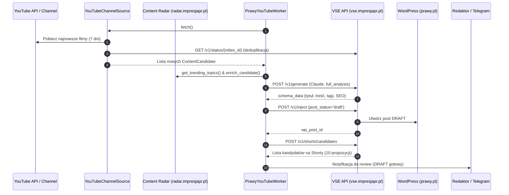

# prawy-youtube-worker

> media-dispatch | media-dev-architect-02 | 01.09.2026  
> Status: **v1.0 skeleton** — architektura zintegrowana z `WorkerBase`, VSE pipeline live, source w trybie integracji

## Cel

`prawy-youtube-worker` to autonomiczny worker i agent monitorujący kanał **Studio Prawy_PL** (`UCoH2G9By4OX3kcLsc8lHgDw`) dla portalu **prawy.pl**.
Wykrywa nowe materiały wideo z napisami, przetwarza je przez silnik **Video SEO Engine (VSE)** w celu generowania artykułu oraz propozycji shortów, a następnie przygotowuje drafty wpisów na WordPressie pod weryfikację redaktora.

---

## ⛔ Reguła Publikowania (Safety & Human-in-the-Loop)

> **ZASADA NADRZĘDNA:**
> - WordPress: status zawsze **`draft`**
> - YouTube: status zawsze **`unlisted`**
> 
> Worker **NIGDY** nie publikuje automatycznie na produkcję bez zatwierdzenia przez Redaktora Naczelnego lub użytkownika.

---

## Architektura i Flow

```
YouTube Channel (Studio Prawy_PL)
       │
       ▼
[YouTubeChannelSource] ──── (filtruje istniejące w VSE + sprawdza napisy)
       │
       ▼
[ContentRadarSignal]   ──── (wzbogaca o viral score z radar.impresjapr.pl)
       │
       ▼
[PrawyYouTubeWorker]
       │
       ├── 1. POST /v1/generate          ──> VSE: Pełna transkrypcja i analiza SEO (Claude 3.5 Sonnet)
       ├── 2. POST /v1/inject            ──> WP: Utworzenie wpisu w statusie DRAFT (video format)
       ├── 3. POST /v1/shorts/candidates ──> VSE: Wykrycie 10 najciekawszych fragmentów (Shorts)
       └── 4. Editorial Notification     ──> Powiadomienie redaktora (Telegram / Inbox)
```

### Diagram Sekwencji



---

## Konfiguracja i Uruchomienie

### Zmienne środowiskowe

| Zmienna | Wymagana | Opis |
|---------|----------|------|
| `VSE_JWT` | **TAK** | JWT Bearer token do autoryzacji w VSE API (`https://vse.impresjapr.pl`) |
| `CONTENT_RADAR_JWT` | Opcjonalna | JWT Bearer token do Content Radar (`https://radar.impresjapr.pl`) dla scoringu trendów |

### Komendy CLI

```bash
# 1. Health check wszystkich komponentów i zarejestrowanych pluginów
python agents/prawy-youtube-worker/worker.py --health

# 2. Przetworzenie pojedynczego filmu (manual trigger po ID)
python agents/prawy-youtube-worker/worker.py --video-id dQw4w9WgXcQ

# 3. Pełny skan kanału i przetworzenie nowych materiałów
python agents/prawy-youtube-worker/worker.py --run
```

---

## Identyfikatory i Parametry

| Parametr | Wartość | Opis |
|----------|---------|------|
| **Portal** | `prawy.pl` | Nazwa domeny portalu |
| **Portal ID (UUID)** | `2b047d7d-15a1-4d2f-8463-f89c2275bb73` | UUID portalu w VSE |
| **Kanał YouTube ID** | `UCoH2G9By4OX3kcLsc8lHgDw` | Studio Prawy_PL |
| **VSE API URL** | `https://vse.impresjapr.pl` | Produkcyjny endpoint VSE (port 8085 wewn.) |
| **Content Radar URL** | `https://radar.impresjapr.pl` | Produkcyjny endpoint analizy trendów |
| **Plik stanu** | `agents/prawy-youtube-worker/prawy_yt_state.json` | Lokalny checkpoint / cache stanu |

---

## Status Implementacji

| Komponent / Krok | Status | Opis |
|------------------|--------|------|
| `PrawyYouTubeWorker` | ✅ Gotowy (v1.0) | Bazuje na `WorkerBase`, obsługuje CLI `--health`, `--video-id`, `--run` |
| `VSE Pipeline (process)` | ✅ Gotowy | `generate` (Claude), `inject` (draft), `shorts/candidates` |
| `ContentRadarSignal` | ✅ Gotowy (Live) | Działa natychmiast po podaniu `CONTENT_RADAR_JWT` |
| `YouTubeChannelSource` | 🟡 Skeleton / Plugin | Struktura gotowa, metody pomocnicze `_already_in_vse` i `_has_captions`, `fetch()` w trybie integracji |
| `Editorial Review (Telegram)` | 🔵 Faza 2 / 4 | Integracja z `redaktor-naczelny-bot` |

---

## Rozszerzanie (Extensibility)

### 1. Dodanie nowego kanału (np. Prawy Biblijny)
Możesz zarejestrować kolejne instancje `YouTubeChannelSource` w konstruktorze workera:

```python
# Prawy Biblijny (playlista PLw7UeigJuyWkUzzvhS1vZX0H251raaYa7)
self.add_source(YouTubeChannelSource(
    channel_id='UC_BIBLIJNY_ID',
    portal='prawy.pl',
    vse_api_url=VSE_URL,
    vse_token=vse_token,
    days_back=7
))
```

### 2. Dodanie kolejnych sygnałów trendów
Dołącz dowolny plugin dziedziczący po `TrendSignal` (np. `GoogleTrendsSignal`, `SocialTrendsSignal`):

```python
from agents.base.trend_signals.google_trends_signal import GoogleTrendsSignal

self.add_trend_signal(GoogleTrendsSignal())
```
