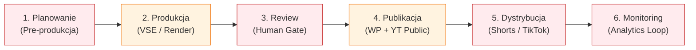

# Analiza UX i Architektury Google Sheets 'Nagrania prawy' pod kątem Workflow Redakcyjnego

> **Autor:** `media-analyst` (`[media-analyst-sheets]`)  
> **Data:** 01.09.2026  
> **Workspace:** `media-dispatch`  
> **Arkusz źródłowy:** [Google Sheets: Nagrania prawy (ID: `1zqwvS784EaZh1EJIcXk1DliAau1r4X15ENFJjloDSaM`, GID: `809929940`)](https://docs.google.com/spreadsheets/d/1zqwvS784EaZh1EJIcXk1DliAau1r4X15ENFJjloDSaM/edit?gid=809929940)  
> **Status:** Analiza gotowa / Rekomendacje dla Zespołu Redakcyjnego i Deweloperskiego  

---

## 1. Wstęp i Kontekst Operacyjny

System **media-dispatch** osiągnął etap zaawansowanej automatyzacji produkcji treści wideo i artykułów dla Grupy Impresja PR (obsługa kanałów YouTube **Studio Prawy_PL** / **Prawy TV** / **Prawy Biblijny** oraz portalu **Prawy.pl**, a także planowane portale **Kurier365.pl** i **BiznesCiti.com**).

W architekturze uczestniczą silniki autonomiczne:
- **VSE (Video SEO Engine)** — generowanie transkrypcji Whisper, artykułów WordPress, metadanych SEO Rank Math, ekstrakcja kandydatów na shorty i rendering 9:16.
- **Short Machine (`POST /v1/shorts/describe`)** — optymalizacja tytułów (max 45 zn), opisów bez URL, precyzyjnych hashtagów i polaryzujących przypiętych komentarzy retencyjnych (APV).
- **Zautomatyzowane workery dystrybucji** — `vse-worker`, `shorts-agent`, `tiktok-worker`, `pressai-worker`.

**Google Sheets 'Nagrania prawy'** pełni w tym ekosystemie rolę centralnego kokpitu decyzyjnego dla człowieka (Human-in-the-Loop) — redaktora naczelnego, dziennikarzy, montażystów i wydawców.

Niniejszy raport stanowi całościowy audyt UX, struktury danych i procesów operacyjnych arkusza, definiując luki w przepływie pracy oraz przedstawiając nową architekturę danych i plan wdrożenia.

---

## A. Co jest dobre w obecnej strukturze (Mocne strony)

1. **Jednoznaczny klucz główny (`YouTube ID` + `Lp`)**:
   - `YouTube ID` (11-znakowy identyfikator wideo) oraz `Lp` stanowią niezawodny, unikalny klucz logiczny dla skryptów synchronizacyjnych (`update_editorial.py`, `vse-worker`, `shorts-agent`), eliminując ryzyko duplikacji danych i konfliktów.
2. **Kompaktowa baza linków i identyfikacji**:
   - Bezpośrednia obecność pól `YT URL` oraz `WP Draft URL` w jednym wierszu umożliwia natychmiastowe przejście do podglądu materiału na YouTube oraz panelu edycji WordPress.
3. **Wdrożenie dedykowanych kolumn SEO i Short Machine (kolumny L–O)**:
   - Dodanie kolumn `Shorty`, `Short Machine`, `Tytuł SEO` oraz `Frazy kluczowe` było kluczowym krokiem integrującym arkusz z wymogami pozycjonowania (Rank Math / YouTube Metadata).
4. **Dostępność i brak bariery wejścia dla redakcji**:
   - Google Sheets zapewnia jednoczesną, bezkolizyjną pracę wielu członków redakcji (współdzielenie w czasie rzeczywistym) bez konieczności instalowania dedykowanego oprogramowania na stacjach roboczych.
5. **Dobra podatność na integracje API (gspread / Google Service Account / OAuth)**:
   - Struktura tabelaryczna pozwala na bezpośrednią automatyzację dwukierunkową przez Pythona i Google Apps Script.

---

## B. Luki w workflow redakcyjnym (Analiza 6 etapów)

Poniższa analiza dekonstruuje pełny cykl życia materiału redakcyjnego pod kątem ograniczeń obecnego arkusza.



### 1. Etap Planowania (Co nagrywamy? Pre-produkcja) — 🔴 LUKA KRYTYCZNA
- **Stan obecny:** Arkusz zakłada, że wiersz powstaje dopiero wtedy, gdy film jest już nagrany i wgrany na YouTube (wymaga `YouTube ID`).
- **Problemy:**
  - Brak możliwości zarejestrowania planowanego nagrania w studio przed realizacją.
  - Brak pól na nazwisko **Gościa/Rozmówcy**, **Prowadzącego wywiad**, temat roboczy i tezy do dyskusji.
  - Brak rozróżnienia na `Datę nagrania w studio` oraz `Datę emisji/premiery` (nagrania leżą czasem kilka dni przed emisją).

### 2. Etap Produkcji (VSE generate, transkrypcja Whisper, rendering shortów) — 🟡 LUKA ZNACZNA
- **Stan obecny:** W arkuszu pojawiają się wpisy tekstowe w polu `Notatki` (np. *"Klimczak Płużański Wolińska, render shortów w toku"*, *"User powiedział hold. VSE done, wp_id=0"*).
- **Problemy:**
  - Redaktor i montażysta nie widzą technicznego stanu przetwarzania VSE (czy Whisper transkrybuje, czy generuje się artykuł, czy renderują się klipy 9:16 `_raw.mp4`).
  - Brak rozdzielenia statusu technologicznego backendu (`vse_status: queued / processing / done / error`) od statusu redakcyjnego.

### 3. Etap Review & Akceptacji (Tytuł, lead, miniatura, SEO) — 🔴 LUKA KRYTYCZNA
- **Stan obecny:** Brak dedykowanych kontrolek akceptacyjnych. Wszystko opiera się na nieformalnych wpisach w kolumnie `Notatki`.
- **Problemy:**
  - Redaktor naczelny nie ma prostego mechanizmu zatwierdzenia lub odrzucenia wersji wygenerowanej przez AI (`Zatwierdź` / `Popraw`).
  - Brak rejestru odpowiedzialności: **Kto zatwierdził** materiał do emisji i **kiedy** (timestamp).
  - Brak weryfikacji miniatury graficznej (czy miniatura z poprawnym tytułem jest przygotowana i wgrana do WordPressa i YouTube).

### 4. Etap Publikacji (WP publish, YouTube public / schedule) — 🟡 LUKA ZNACZNA
- **Stan obecny:** W jednej kolumnie `Status` mieszają się pojęcia o różnym charakterze (`draft`, `opublikowany`, `wstrzymany`, `hold`, `publikacja w toku`).
- **Problemy:**
  - Brak jednoznacznego rozdzielenia stanu publikacji w WordPressie (`Draft` vs `Scheduled` vs `Published`) oraz stanu na YouTube (`Private` vs `Unlisted` vs `Scheduled` vs `Public`).
  - Brak automatycznego triggera akcji — zmiana statusu w arkuszu na `DO PUBLIKACJI` nie wywołuje automatycznego zadania publikującego w workerze.

### 5. Etap Dystrybucji (Shorty, TikTok, Telegram) — 🔴 LUKA KRYTYCZNA
- **Stan obecny:** Z jednego filmu długiego (long-form) powstaje od 4 do 8 shortów. W wierszu filmu głównego jest tylko pojedyncza komórka: `5`, `5 (render)` lub `0`.
- **Problemy:**
  - Całkowity brak widoczności poszczególnych klipów podrzędnych (Child Shorts).
  - Redaktor nie widzi wygenerowanych przez Short Machine tytułów (max 45 zn), przypiętych komentarzy (`pinned_comment`) podbijających retencję (APV > 100%), hashtagów, zaplanowanych slotów godzinowych (`07:00`, `12:00`, `18:00`, `21:00 CEST`) ani statusu montażu (`_raw.mp4` vs `_gotowy.mp4`).
  - Brak śledzenia publikacji na TikToku i Telegramie.

### 6. Etap Monitoringu i Feedbacku (Wyniki, oglądalność, CTR) — 🔴 LUKA KRYTYCZNA
- **Stan obecny:** Po opublikowaniu materiału wiersz staje się pasywny i martwy.
- **Problemy:**
  - Brak jakiejkolwiek telemetrii: wyświetlenia po 24h, 48h, 7 dniach, wskaźnik CTR miniatury, średni procent obejrzenia (Average Percentage Viewed dla Shortów), ruch na prawy.pl.
  - Redakcja nie otrzymuje twardych danych zwrotnych, które tematy i goście budują największe zaangażowanie.

---

## C. Konkretne propozycje ulepszeń arkusza

| # | Obszar ulepszenia | Proponowana zmiana | Dlaczego to konieczne? | Priorytet |
|---|---|---|---|:---:|
| **1** | **Rozbicie dat i slotów** | Dodanie kolumn: `Data nagrania`, `Data emisji`, `Slot godzinowy` (np. 18:00 CEST). | Eliminuje chaos między momentem realizacji w studio a datą publikacji na kanałach. | **P0** |
| **2** | **Autor, Gość i Prowadzący** | Kolumny: `Gość / Rozmówca`, `Prowadzący redaktor`. | Pozwala filtrować materiały po osobach, budować statystyki gości i poprawnie tagować wpisy WP. | **P0** |
| **3** | **Rozdzielenie statusów** | Rozbicie pojedynczej kolumny na: `Status VSE`, `Status Review`, `Status WP`, `Status YouTube`. | Likwiduje niejednoznaczność stanu materiału (np. wygenerowany w WP jako draft, ale niezatwierdzony przez redaktora). | **P0** |
| **4** | **Human-in-the-Loop Gate** | Kolumny: `Status Akceptacji` (Dropdown: *Do akceptacji*, *Zatwierdzony*, *Do poprawy*, *Hold*), `Zatwierdzający`, `Data akceptacji`. | Wprowadza ścisłą odpowiedzialność redakcyjną i jasną bramkę jakościową. | **P0** |
| **5** | **Powiązanie Parent ↔ Child Shorts** | Nowa dedykowana zakładka `📱 Shorts & Reels` powiązana z `Parent YouTube ID`. | Zapewnia pełną kontrolę nad ~6 shortami z każdego filmu: tytuł <=45 zn, pinned comment, sloty 07/12/18/21, status montażu. | **P0** |
| **6** | **Kategoryzacja WordPress i SEO** | Kolumny: `Kategoria WP`, `Tagi / Słowa kluczowe`, `Tytuł SEO (Rank Math)`. | Redaktor ma natychmiastowy wgląd w pozycjonowanie artykułu bez otwierania panelu WP-Admin. | **P1** |
| **7** | **Triggery i powiadomienia (Action Hooks)** | Przycisk / checkbox `Trigger: Publikuj / Zaplanuj` powiązany z webhookiem / Telegram Botem. | Umożliwia redaktorowi bezpośrednie wywołanie publikacji lub wysłanie alertu do wydawcy z poziomu arkusza. | **P1** |
| **8** | **Aktywne linkowanie i miniatury** | Formuły `=HYPERLINK(url; "Otwórz WP")` oraz kolumna `Miniatura status` (lub miniatura podglądowa `=IMAGE()`). | Poprawia czytelność UI i eliminuje długie, nieczytelne ciągi znaków w komórkach. | **P1** |
| **9** | **Telemetria i Analytics Loop** | Kolumny: `Wyświetlenia 24h`, `Wyświetlenia 7d`, `CTR %`, `Odsłony WP`. | Zautomatyzowany nocny worker zaciąga wyniki z YouTube Data API i WP REST API, zamykając pętlę analityczną. | **P2** |
| **10** | **Widok kalendarzowy (Timeline / Apps Script)** | Automatyczny widok kalendarza publikacji (lub funkcja Timeline View Google Sheets). | Przejrzysty widok ramówki tygodniowej dla dyrekcji i wydawców. | **P2** |

---

## D. Propozycja nowej architektury zakładek

Docelowa struktura arkusza `Nagrania prawy` powinna składać się z **5 wyspecjalizowanych zakładek**:

```
                              [ARKUSZ: NAGRANIA PRAWY]
 ├── 1. 📅 Harmonogram Emisji (Long-Form & WP) ── Główny kokpit operacyjny filmów i artykułów
 ├── 2. 📱 Shorts & Reels (Multi-Platform) ────── Matryca krótkich form powiązana relacyjnie z filmem
 ├── 3. 💡 Planowanie & Bank Tematów ──────────── Pre-produkcja, rezerwacja gości, tezy i briefy
 ├── 4. 📊 Analityka & Wyniki (Performance) ───── Monitoring wyświetleń, CTR, retencji i odsłon WP
 └── 5. ⚙️ Słowniki & Konfiguracja ────────────── Dane walidacyjne (dropdowny, kategorie, godziny)
```

---

### Zakładka 1: `📅 Harmonogram Emisji (Long-Form & WP)`
Główna tabela operacyjna dla wywiadów, debat i odcinków biblijnych.

#### Schemat kolumn (Kolejność logiczna):
1. **`Lp`** (ID rekordu)
2. **`Data emisji`** (Format: `YYYY-MM-DD`, np. `2026-09-01`)
3. **`Godzina slotu`** (Dropdown: `00:00`, `07:00`, `12:00`, `18:00`, `20:00`)
4. **`YouTube ID`** (11 znaków, klucz główny)
5. **`Tytuł odcinka`** (Tytuł redakcyjny / YouTube)
6. **`Gość / Rozmówca`** (np. *Jan Mosiński*, *Tadeusz Płużański*, *Jan Rulewski*)
7. **`Prowadzący`** (np. *Tomasz*, *Klimczak*, *Redakcja*)
8. **`Kategoria WP`** (Dropdown: *Publicystyka*, *Historia*, *Gospodarka*, *Kościół / Biblia*, *Polityka*)
9. **`Czas trwania`** (np. `53:08`)
10. **`Status Pipeline VSE`** (Badge / Dropdown: `Oczekuje`, `Whisper w toku`, `VSE gotowe`, `Błąd`)
11. **`Status Review (Human Gate)`** (Badge / Dropdown: `Do akceptacji`, `ZATWIERDZONY`, `Do poprawy`, `HOLD`)
12. **`Status WP`** (Badge / Dropdown: `Brak`, `Draft`, `Zaplanowany`, `Opublikowany`)
13. **`Status YouTube`** (Badge / Dropdown: `Private`, `Unlisted`, `Scheduled`, `Public`)
14. **`Link YouTube`** (Formuła: `=HYPERLINK(E2; "📺 Wideo")`)
15. **`Link WordPress`** (Formuła: `=HYPERLINK(G2; "📝 Artykuł")`)
16. **`Miniatura Status`** (Dropdown: `Brak`, `Do przygotowania`, `Wgrana`)
17. **`Liczba Shortów`** (Formuła zliczająca z zakładki Shorts: `=COUNTIF('Shorts & Reels'!B:B; D2)`)
18. **`Zatwierdził(a)`** (Imię / Callsign, np. `media-strateg`, `Tomasz`)
19. **`Notatki redakcyjne`** (Komentarze, dyspozycje, uwagi do montażu)

---

### Zakładka 2: `📱 Shorts & Reels (Multi-Platform)`
Dedykowana matryca zarządzania krótkimi formami wideo 9:16 (YouTube Shorts, TikTok, Telegram).

#### Schemat kolumn:
1. **`Short ID`** (Unikalny identyfikator klipu lub YouTube Short ID)
2. **`Parent YouTube ID`** (Relacja do filmu głównego z Zakładki 1)
3. **`Tytuł filmu bazowego`** (Formuła lookup po Parent ID: `=VLOOKUP(B2; 'Harmonogram Emisji'!D:E; 2; FALSE)`)
4. **`Zoptymalizowany Tytuł Shorta`** (Maksymalnie 45 znaków — generowany przez Short Machine)
5. **`Data publikacji Shorta`** (Format: `YYYY-MM-DD`)
6. **`Slot godzinowy`** (Dropdown: `07:00`, `12:00`, `18:00`, `21:00 CEST`)
7. **`Status montażu (Quality Gate)`** (Dropdown: `1. Surowy (_raw.mp4)`, `2. ZAAKCEPTOWANY (_gotowy.mp4)`, `3. Odrzucony`)
8. **`Short Machine SEO`** (Dropdown: `Do wygenerowania`, `W toku`, `GOTOWE`)
9. **`Przypięty Komentarz (Pinned Comment & CTA)`** (Tekst pytania polaryzującego + odniesienie do `related_video_id`)
10. **`Hashtagi`** (Max 5 hashtagów tematycznych bez `#Shorts`)
11. **`Status YouTube Shorts`** (Dropdown: `Private`, `Scheduled`, `Public`)
12. **`Status TikTok`** (Dropdown: `Do publikacji`, `Opublikowano`, `Pomiń`)
13. **`Status Telegram`** (Dropdown: `Do wysłania`, `Wysłano`)
14. **`Wynik APV % (Retencja)`** (Aktualizowane automatycznie z YouTube Data API)
15. **`Wyświetlenia 7d`** (Liczba odsłon)

---

### Zakładka 3: `💡 Planowanie & Bank Tematów`
Moduł pre-produkcji i organizacji pracy studia nagraniowego.

#### Schemat kolumn:
1. **`ID Tematu`** (np. `PLAN-2026-001`)
2. **`Planowana data nagrania`** (Data rezerwacji studia)
3. **`Temat rozmowy / Teza główna`** (Opis zagadnienia)
4. **`Gość / Kontakt`** (Imię, nazwisko, funkcja, telefon/mail)
5. **`Prowadzący`** (Dziennikarz prowadzący wywiad)
6. **`Materiały źródłowe / Brief`** (Linki do artykułów, orzeczeń, dokumentów)
7. **`Status przygotowania`** (Dropdown: *Propozycja*, *Potwierdzony termin*, *Nagrane w studio*, *Anulowane*)
8. **`Docelowy kanał`** (Dropdown: *Studio Prawy_PL*, *Prawy TV*, *Prawy Biblijny*)

---

### Zakładka 4: `📊 Analityka & Wyniki (Performance)`
Moduł analizy efektywności i zwrotu z treści (Feedback Loop).

#### Schemat kolumn:
1. **`YouTube ID`** (Klucz)
2. **`Tytuł materiału`**
3. **`Data publikacji`**
4. **`Wyświetlenia YT (24h)`**
5. **`Wyświetlenia YT (7 dni)`**
6. **`CTR Miniatury %`**
7. **`Średni czas oglądania (AVD)`**
8. **`Odsłony artykułu Prawy.pl`**
9. **`Skuteczność (Rating)`** (Formuła obliczająca gwiazdki / ocenę wiralowości)

---

### Zakładka 5: `⚙️ Słowniki & Konfiguracja`
Baza wartości referencyjnych dla reguł sprawdzania poprawności danych (Data Validation):
- **Słownik Statusów Review:** `Do akceptacji`, `ZATWIERDZONY`, `Do poprawy`, `HOLD`.
- **Słownik Statusów Publikacji:** `Brak`, `Draft`, `Zaplanowany`, `Opublikowany`, `Private`, `Unlisted`, `Public`.
- **Słownik Prowadzących:** `Tomasz`, `Klimczak`, `Redakcja`, itp.
- **Słownik Kategorii WP:** `Publicystyka`, `Historia`, `Gospodarka`, `Kościół`, `Polityka`, `Prawo`.
- **Słownik Slotów Emisji:** `00:00`, `07:00`, `12:00`, `18:00`, `20:00`, `21:00`.

---

## E. Quick wins (Do zrobienia od razu — bez zmian architektonicznych)

Oto **3 konkretne usprawnienia**, które worker (`media-dev`) może wdrożyć **DZIŚ**, przynosząc natychmiastowy skok jakości pracy redakcji:

### ⚡ Quick Win 1: Walidacja danych (Dropdowny) i warunkowe kolorowanie (Conditional Formatting)
- **Co zrobić:** 
  - W kolumnie `Status` (kolumna J) oraz `Short Machine` (kolumna M) ustawić sztywne reguły Data Validation (listy rozwijane).
  - Wdrożyć reguły kolorystyczne:
    - 🟢 **Zielony:** `opublikowany` / `TAK` / `ZATWIERDZONY`
    - 🟡 **Żółty:** `publikacja w toku` / `W TOKU` / `draft`
    - 🔴 **Czerwony:** `wstrzymany` / `hold` / `NIE`
    - 🔵 **Niebieski:** `Do akceptacji`
- **Efekt:** Natychmiastowa eliminacja literówek w statusach i czytelny stan ramówki na pierwszy rzut oka.

### ⚡ Quick Win 2: Wzbogacenie nagłówków o `Gość / Prowadzący` i `Kategoria WP`
- **Co zrobić:**
  - Zaktualizować skrypt `agents/sheets-sync-worker/update_editorial.py` o wstawienie kolumn:
    - Kolumna P (16): `Gość / Rozmówca`
    - Kolumna Q (17): `Prowadzący`
    - Kolumna R (18): `Kategoria WP`
  - Wypełnić te wartości dla wierszy 10–14 (np. Mosiński, Rulewski, Płużański).
- **Efekt:** Pełna przejrzystość obsady personalnej każdego nagrania i precyzyjne kierowanie artykułów do działów portalu.

### ⚡ Quick Win 3: Estetyka UI — zamiana surowych linków na formuły `=HYPERLINK()` oraz zawijanie tekstu (Wrap)
- **Co zrobić:**
  - W komórkach `YT URL` oraz `WP Draft URL` zastąpić długie ciągi tekstowe formułami:
    - `=HYPERLINK("https://www.youtube.com/watch?v=s6aGNXdtKpA"; "📺 YouTube")`
    - `=HYPERLINK("https://prawy.pl/porozumienia-sierpniowe-1980..."; "📝 WP Artykuł")`
  - Włączyć `Wrap text` (zawijanie wierszy) dla kolumn `Tytuł`, `Krótki opis` i `Tytuł SEO` oraz zablokować 1. wiersz nagłówkowy (`Freeze 1 row`).
- **Efekt:** Znaczące zwężenie arkusza, brak ucinania tekstu i błyskawiczne otwieranie linków w nowej karcie bez rozciągania tabeli.

---

## 3. Podsumowanie i Następne Kroki

Wdrożenie powyższych rekomendacji przekształci Google Sheets z pasywnego rejestru w **interaktywne centrum dowodzenia Human-in-the-Loop**, łączące pracę dziennikarzy z autonomicznymi workerami AI.

### Rekomendowany harmonogram wdrożenia:
1. **Dziś (Sprint 1):** Wdrożenie 3 Quick Wins w obecnej zakładce przez `media-dev` (aktualizacja `update_editorial.py` + formatowanie arkusza).
2. **Kolejna sesja (Sprint 2):** Utworzenie zakładki `📱 Shorts & Reels` i zsynchronizowanie jej z pipeline'em Short Machine (`POST /v1/shorts/describe`).
3. **Faza 3:** Wdrożenie dwukierunkowej synchronizacji z Telegram Botem (`redaktor-naczelny-bot`) i automatycznego nocnego monitora wyświetleń.

---

*[media-analyst-sheets | media-dispatch 01.09.2026] — Raport UX i architektury kompletny*
