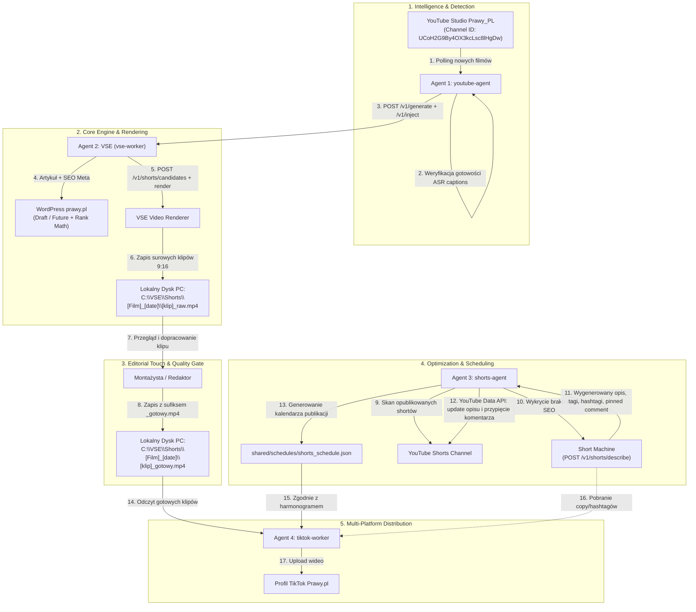

# Architektura Shorts Pipeline — Studio Prawy_PL & media-dispatch

> **Autor**: `media-analyst` / `media-dev-12` | **Data**: 2026-08-31 | **Workspace**: `media-dispatch`  
> **Status**: Specyfikacja Architektoniczna v1.1 (Short Machine API /v1/shorts/describe na produkcji) | **Branch**: `main`

---

## 1. Wprowadzenie i Cel Biznesowy

Kanał **Studio Prawy_PL** (`UCoH2G9By4OX3kcLsc8lHgDw`) oraz portal **Prawy.pl** produkują codzienne materiały wideo (analizy polityczne, publicystykę, komentarze). Format długi (long-form wideo) jest fundamentem treści, jednak największy potencjał wiralowy oraz pozyskiwania nowych subskrybentów leży w formatach pionowych 9:16 (**YouTube Shorts** oraz **TikTok**).

Niniejszy dokument opisuje kompletną, 4-agentową architekturę **Shorts Pipeline**: od wykrycia filmu z gotowymi napisami na YouTube, przez generowanie surowych klipów w VSE i obróbkę redakcyjną na PC, aż po optymalizację SEO przez moduł **Short Machine** (`POST /v1/shorts/describe`), harmonogramowanie i publikację na TikToku.

---

## 2. Diagram Przepływu (End-to-End Pipeline)



---

## 3. Szczegółowy Opis 4 Agentów

| Agent | Typ / Status | Odpowiedzialność | Główne Wejścia (Input) | Główne Wyjścia (Output) |
|---|---|---|---|---|
| **Agent 1: `youtube-agent`** | Planowany (`media-dispatch`) | Monitorowanie kanału YT, gating gotowości transkrypcji (ASR), dispatch do VSE | YouTube Data API (`UCoH2G9By4OX3kcLsc8lHgDw`) | Taski przetwarzania dla VSE |
| **Agent 2: `vse-worker`** | Istniejący (`prawy-studio-worker`) | Generowanie artykułu WP, SEO, kandydatów shortów Claude, renderowanie wideo 9:16 | YouTube URL / Video ID, audio/wideo | Artykuł WP, zaktualizowany film YT, pliki `_raw.mp4` w `C:\VSE\Shorts\` |
| **Agent 3: `shorts-agent`** | Specyfikacja gotowa, impl. Q1 09.2026 | Skanowanie opublikowanych shortów, generowanie opisów SEO (Short Machine `/v1/shorts/describe`), aktualizacja YT API, harmonogramowanie | Lista shortów YT, API Short Machine, konfiguracja slotów czasowych | Zaktualizowane opisy na YT, przypięte komentarze, plik harmonogramu `shorts_schedule.json` |
| **Agent 4: `tiktok-worker`** | Planowany (Faza 5b) | Publikacja gotowych klipów pionowych na platformie TikTok | Pliki `*_gotowy.mp4`, metadane z Short Machine, harmonogram | Opublikowane wideo TikTok, logi publikacji |

---

### Agent 1: `youtube-agent` (Ingestion & Gating)
- **Rola**: Autonomiczny monitor kanału Studio Prawy_PL.
- **Działanie**:
  1. Cyklicznie (cron co 15–30 minut) sprawdza listę najnowszych wideo na kanale `UCoH2G9By4OX3kcLsc8lHgDw`.
  2. Sprawdza status napisów (Captions API). Jeśli napisy automatyczne (`ASR`) nie są jeszcze przeliczone przez YouTube — czeka i ponawia próbę w kolejnym cyklu (tzw. Captions Gating).
  3. Po potwierdzeniu gotowości napisów wywołuje pipeline w `vse-worker` lub bezpośrednio endpointy VSE.

---

### Agent 2: `vse-worker` (Core Generation & Video Rendering)
- **Rola**: Główny silnik produkcyjny VSE (Video SEO Engine).
- **Działanie**:
  1. `POST /v1/generate` (LLM Claude 3.5 Sonnet) $\rightarrow$ generuje artykuł na portal prawy.pl, lead, frazy kluczowe, FAQ, rozdziały.
  2. `POST /v1/inject` $\rightarrow$ wstrzykuje draft/future do WordPressa z miniaturą YT i metadanymi Rank Math.
  3. `PUT /v1/youtube/publish-description` $\rightarrow$ aktualizuje opis filmu na YouTube o rozdziały, linki i CTA.
  4. `POST /v1/shorts/candidates` $\rightarrow$ Claude analizuje transkrypt VTT i wskazuje 5–10 najciekawszych fragmentów (timecodes start/end, hook, score wiralowości).
  5. `POST /v1/shorts/render` $\rightarrow$ VSE renderuje surowe klipy wideo w formacie 9:16 i zapisuje je lokalnie.

---

### Agent 3: `shorts-agent` (SEO Optimization & Scheduling)
- **Rola**: Strażnik optymalizacji SEO dla formatu krótkiego oraz planista publikacji.
- **Działanie**:
  1. **Skanowanie YouTube**: Odpytuje YouTube Data API o opublikowane shorty na kanale Studio Prawy_PL.
  2. **Audyt Opisów**: Sprawdza, czy dany Short posiada pełny opis SEO wygenerowany przez Short Machine (`description.length < 50` lub tytuł tożsamy z nazwą pliku `.mp4`).
  3. **Wzbogacenie przez Short Machine**: Jeśli opis jest pusty lub szczątkowy $\rightarrow$ przesyła `youtube_id` do `POST /v1/shorts/describe`, pobiera zoptymalizowany pakiet SEO i aktualizuje wideo przez `videos.update`.
  4. **Przypięty Komentarz**: Wstawia `pinned_comment` przez `commentThreads.insert` i przypina go dla wymuszenia pętli retencji (APV).
  5. **Harmonogramowanie**: Na podstawie bazy zidentyfikowanych surowych/gotowych klipów (~6 z jednego filmu głównego) wylicza optymalny kalendarz dystrybucji na kolejne dni i godziny (`07:00`, `12:00`, `18:00`, `21:00 CEST`).

---

### Agent 4: `tiktok-worker` (Multi-Platform Distribution)
- **Rola**: Eksporter gotowych klipów na profil TikTok.
- **Działanie**:
  1. Monitoruje katalogi `C:\VSE\Shorts\[Film]_[date]\` w poszukiwaniu plików oznaczonych sufiksem `*_gotowy.mp4`.
  2. Odczytuje metadane (tytuł, opis, hashtagi) zsynchronizowane przez Short Machine.
  3. Publikuje materiał na TikToku zgodnie z wyznaczonym slotem z pliku harmonogramu.

---

## 4. Struktura Katalogów na PC

Pliki wideo przetwarzane lokalnie w środowisku Windows posiadają ściśle zdefiniowaną strukturę katalogów oraz konwencję nazewnictwa plików:

```text
C:\VSE\Shorts\
  ├── [Nazwa_Filmu]_[YYYY-MM-DD]\          ← folder dedykowany per film bazowy
  │     ├── metadata.json                   ← metadane kandydatów z VSE (timecodes, hooki)
  │     ├── [klip_1]_raw.mp4               ← surowy klip 9:16 zrenderowany przez VSE
  │     ├── [klip_1]_gotowy.mp4            ← klip po montażu/akceptacji usera (GOTOWY DO PUBLIKACJI)
  │     ├── [klip_2]_raw.mp4
  │     ├── [klip_2]_gotowy.mp4
  │     ├── [klip_3]_raw.mp4
  │     └── [klip_3]_gotowy.mp4
  └── ...
```

### Zasady konwencji nazewniczej:
1. `_raw.mp4` — plik wyjściowy z automatycznego renderingu VSE. Zawiera wycięty kadr pionowy z nałożonymi napisami automatycznymi.
2. `_gotowy.mp4` — plik, który przeszedł przez weryfikację człowieka (montażysty/redaktora). Może zawierać poprawione kadrowanie, dodatkowe plansze lub poprawione literówki w napisach.
3. **Zasada bezpieczeństwa**: Agenty dystrybucyjne (`tiktok-worker`, uploadery) **nigdy nie publikują plików `_raw.mp4`**. Publikacji podlegają wyłącznie pliki posiadające w nazwie sufiks `_gotowy.mp4`.

---

## 5. Short Machine — Koncepcja i Specyfikacja API

### 5.1. Czym jest Short Machine?
**Short Machine** to moduł produkcyjny VSE optymalizacji SEO dla formatów pionowych (Shorts / Reels / TikTok). Działa w kontenerze `vse-api` na porcie `8085` od 31.08.2026.
Kluczowe założenia SEO 2026:
- **Hook / Optimized Title**: Max 45 znaków, front-loaded, bez `#Shorts` (aby nie obcinać na smartfonach).
- **Maksymalnie skondensowany opis**: 150–350 znaków, słowa kluczowe z transkrypcji, **BEZ URL** (linki w shortach są nieklikalne od 2023).
- **Precyzyjny zestaw hashtagów**: Max 5 hashtagów tematycznych/kanałowych (BEZ `#Shorts`).
- **Przypięty komentarz (Pinned Comment)**: Polaryzujące pytanie + call-to-action do powiązanego filmu (`related_video_id`), podbijające retencję (APV > 100%).

### 5.2. Specyfikacja Endpointu Produkcyjnego

#### Endpoint: `POST /v1/shorts/describe`
- **Auth**: `Authorization: Bearer <jwt_token>` (ten sam co reszta VSE)
- **Request Body**:
```json
{
  "youtube_id": "ABC123defGH",
  "portal_id": "2b047d7d-15a1-4d2f-8463-f89c2275bb73"
}
```

- **Response Body**:
```json
{
  "optimized_title": "Mocne słowa o podatkach! Zapłacimy więcej?",
  "description": "Gorąca dyskusja w Studio Prawy_PL o nowych regulacjach podatkowych i ich skutkach dla Polaków.\n\n🔔 Subskrybuj @StudioPrawy_PL!\n\n#PrawyPL #Podatki #Gospodarka #Polska #Wiadomości",
  "hashtags": ["#PrawyPL", "#Podatki", "#Gospodarka", "#Polska", "#Wiadomości"],
  "pinned_comment": "💬 Czy Twoim zdaniem nowe regulacje uderzą w Twój portfel? Napisz poniżej! 👇\n\n🎥 Całą rozmowę znajdziesz w powiązanym filmie!",
  "related_video_id": "xyz789longId"
}
```

---

## 6. Harmonogram Publikacji Shortów (Scheduling Engine)

### 6.1. Matematyka i Zasady Rozkładu
- Z jednego filmu pełnometrażowego generowanych jest zazwyczaj **~6 klipów**.
- **Reguła anty-kanibalizacji**: Publikacja 6 shortów w ciągu jednej godziny drastycznie obniża zasięgi w algorytmie YouTube.
- **Strategia dystrybucji**:
  - Rozłożenie materiałów na **2 do 3 dni** (po 2–3 shorty dziennie), lub
  - Rozłożenie na **6 dni** (1 short dziennie, jako stały dopływ ruchu).

### 6.2. Okna Czasowe Najwyższego Zaangażowania (Peak Engagement Slots)
Dla kanałów publicystyczno-informacyjnych w Polsce zdefiniowano 4 kluczowe sloty:
1. **07:00 CEST** — Poranny przegląd wiadomości (dojazd do pracy/szkoły).
2. **12:00 CEST** — Przerwa obiadowa (krótka konsumpcja treści mobilnych).
3. **18:00 CEST** — Popołudniowy szczyt zaangażowania (powrót z pracy).
4. **21:00 CEST** — Wieczorny prime-time (relaks, wysoki watch-time).

### 6.3. Format Danych Harmonogramu (`shared/schedules/shorts_schedule.json`)

```json
{
  "generated_at": "2026-08-31T21:30:00+02:00",
  "parent_video_id": "dL8-MeQobrU",
  "parent_title": "Debata o przyszłości mediów w Polsce",
  "shorts_count": 6,
  "schedule": [
    {
      "short_index": 1,
      "clip_file_raw": "C:\\VSE\\Shorts\\Debata_2026-09-01\\klip_1_raw.mp4",
      "clip_file_ready": "C:\\VSE\\Shorts\\Debata_2026-09-01\\klip_1_gotowy.mp4",
      "youtube_short_id": "sh_111aaa",
      "planned_publish_time": "2026-09-01T07:00:00+02:00",
      "status": "scheduled",
      "platforms": ["youtube_shorts", "tiktok"],
      "seo": {
        "title": "Kluczowy moment debaty!",
        "description": "Zobacz najostrzejszy fragment wymiany zdań...",
        "hashtags": ["#PrawyPL", "#Media", "#Polska"]
      }
    },
    {
      "short_index": 2,
      "clip_file_raw": "C:\\VSE\\Shorts\\Debata_2026-09-01\\klip_2_raw.mp4",
      "clip_file_ready": "C:\\VSE\\Shorts\\Debata_2026-09-01\\klip_2_gotowy.mp4",
      "youtube_short_id": "sh_222bbb",
      "planned_publish_time": "2026-09-01T18:00:00+02:00",
      "status": "pending_manual_edit",
      "platforms": ["youtube_shorts", "tiktok"],
      "seo": {
        "title": "Co dalej z wolnością słowa?",
        "description": "Mocny komentarz redakcji...",
        "hashtags": ["#PrawyPL", "#Polska", "#Opinie"]
      }
    }
  ]
}
```

---

## 7. Otwarte Pytania i Decyzje Architektoniczne (TODO)

1. **Model autoryzacji TikToka**: Czy `tiktok-worker` będzie korzystał z oficjalnego TikTok Content Posting API (wymaga konta deweloperskiego i weryfikacji aplikacji), czy z mechanizmu semi-automated (przygotowanie paczki w chmurze + notyfikacja)?
2. **Kto publikuje Shorty na YouTube**: Czy shorty są wgrywane na YouTube ręcznie przez zespół, a `shorts-agent` je tylko wykrywa i uzupełnia opisy, czy `shorts-agent` docelowo ma sam wrzucać pliki wideo na YouTube Data API (`videos.insert`)?
3. **Automatyzacja Comments API**: Implementacja wstawiania i przypinania `pinned_comment` przez `commentThreads.insert` po publikacji shorta.

---

*[media-analyst | media-dispatch 31.08.2026] — specyfikacja architektury kompletna*  
*[media-dev-12 | media-dispatch 31.08.2026] — aktualizacja: wdrożenie produkcyjne Short Machine API (/v1/shorts/describe)*
